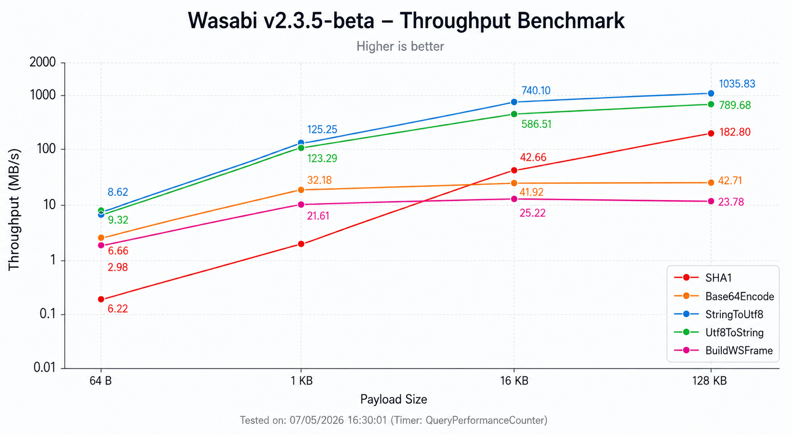

<div align="center">
  
</div>

<h1 align="center">Wasabi</h1>

<p align="center">
  Production-ready WebSocket and WSS for VBA with native TLS, auto reconnect, proxy support, MQTT, permessage-deflate, and zero external dependencies
</p>

<p align="center">
  
  
  
  
  
  
  
  
  
  
  
  
  
  
  
</p>

> [!NOTE]
> **Supported Applications**
> 
> 
> 
> 
> 
> 
> **and** 

> [!IMPORTANT]
> **Platform**
> 
> 

## What is Wasabi

Wasabi is a VBA module designed to make WebSocket communication simple, predictable, and practical — bringing an experience similar to [socket.io](https://socket.io) in Node.js, but entirely within the Office ecosystem. It is a single, self-contained `.bas` file that compiles seamlessly on 32-bit and 64-bit Office hosts, from Windows XP to Windows 11.

Beyond basic WebSocket messaging, Wasabi bundles an MQTT 3.1.1 client, NTLM/Kerberos proxy authentication, RTT latency measurement, fine-grained TLS certificate control, and `permessage-deflate` compression (RFC 7692) — all without mandatory external dependencies.

## Roadmap

- [x] IPv6 and SNI support
- [x] Mutual TLS (mTLS) for client certificate authentication
- [x] SOCKS5 proxy support
- [x] HTTP/2 upgrade via ALPN (opt-in)
- [x] NTLM/Kerberos authentication for HTTP proxies
- [x] **Windows System Proxy Auto-Discovery**
- [x] MQTT 3.1.1 client with **QoS 1 In-Flight Management**
- [x] RTT latency measurement (GetLatency)
- [x] permessage-deflate compression (RFC 7692)
- [x] Zero-copy receive buffers
- [x] MTU-aware frame sizing
- [x] Send batching (text and binary)
- [x] Close frame payload parsing
- [x] Happy Eyeballs (RFC 6555)
- [x] Configurable CRL/OCSP certificate revocation checking
- [x] **Strict State Machine Control** (Connecting/Open/Closing/Closed)
- [ ] `WSAAsyncSelect` event-driven socket notifications
- [ ] `WebSocketStartListening` helper for one-line polling loops

## Why Wasabi exists

VBA is excellent for automation and integration with Excel, PowerPoint, Word and other Office applications, but it hits a wall when real-time communication is required. In practice, anyone trying to build a project that depends on live messaging usually runs into three problems:

- **No standardization:** there is no official, modern path for sockets and WebSockets in VBA.
- **Verbose low-level APIs:** the most common options require a lot of infrastructure code just to connect and maintain a stable session.
- **Limited event-driven patterns:** it is common to end up with loops, timers and control logic just to simulate something that other languages handle natively.

## What VBA limitations it solves

Working with networking in VBA often becomes a project of its own. Some typical pain points:

**Winsock and Windows API calls**
- Require declarations, structs, callbacks and low-level details unrelated to the actual goal.
- Small adjustments can break compatibility or introduce hard-to-track bugs.

**Security**
- Uses `CryptGenRandom` for RFC-compliant frame masking (superior to VBA's `Rnd`).
- Native TLS 1.2/1.3 handling via Schannel SSPI without relying on outdated IE settings.

**Corporate Environments**
- **Auto-Proxy Discovery:** Interacts with `winhttp.dll` to automatically resolve corporate proxies and PAC scripts.
- **NTLM/Kerberos:** Transparently authenticates against secure proxies using current Windows credentials.

**HTTP is not WebSocket**
- Even with WinHTTP or MSXML, you are in a request/response world.
- Real-time scenarios turn into polling, long-polling or workarounds that consume resources and increase latency.

**Limited asynchronism**
- VBA was not designed for modern concurrency.
- Without a good abstraction, it is easy to freeze the UI or create inconsistent state.

**No built-in MQTT, NTLM, or latency measurement**
- IoT integration, corporate proxy authentication, and network diagnostics are common requirements that have no standard VBA solution.
- Wasabi provides all three out of the box: `MqttConnect`, `WebSocketSetProxyNtlm`, and `WebSocketGetLatency`.

**Maintenance and readability**
- Most handcrafted solutions grow long and fragile.
- The networking layer becomes the largest part of the project, making simple things hard to maintain.

**Reliability**
- **QoS 1 MQTT:** Implements a real In-Flight queue with Packet ID tracking, ensuring messages are acknowledged by the broker.
- **MTU Discovery:** Dynamically tunes frame sizes to match network segments, preventing IP fragmentation.

## Where it is useful

- **Bots** (Discord, Slack, Telegram), connect to gateways and handle real-time events and messages directly from Excel or Word
- **Trading and finance**, stream live prices from exchanges like Binance, Coinbase or B3 into spreadsheet cells with millisecond-level latency
- **Dashboards**, update live data on a spreadsheet without manual refresh or polling HTTP endpoints
- **IoT and industrial**, receive sensor data from ESP32, Raspberry Pi or SCADA systems via WebSocket or MQTT directly into Office
- **Games and interactive tools**, build client/server communication for VBA-based games or collaborative tools
- **Corporate automation**, connect Office to internal WebSocket APIs behind proxies and firewalls without installing anything

## Quick Start

### Import

[Download the latest version of Wasabi](../../releases) and import it into your VBA project via
**File → Import File** in the VBA editor.

No references need to be enabled in **Tools → References**.

### Connect and send a message

```vb
Dim h As Long

If WebSocketConnect("wss://echo.websocket.org", h) Then
    WebSocketSend "Hello, Wasabi!", h

    Dim msg As String
    msg = WebSocketReceive(h)

    If msg <> "" Then
        Debug.Print "Received: " & msg
    End If

    WebSocketDisconnect h
End If
```

### Connect with TLS certificate validation

```vb
Dim h As Long

WebSocketSetCertValidation True, h
WebSocketSetRevocationCheck True, h

If WebSocketConnect("wss://example.com/ws", h) Then
    WebSocketSend "Secure hello", h
    WebSocketDisconnect h
End If
```

### MQTT with QoS 1 (Guaranteed Delivery)

```vb
' Connect with subprotocol declaration
WebSocketConnect "ws://[broker.hivemq.com:8000/mqtt](https://broker.hivemq.com:8000/mqtt)", h, , , "mqtt"

MqttConnect "WasabiClient_123", , , 60, h
' Publishes and tracks delivery via internal In-Flight queue
MqttPublish "sensors/data", "Value: 42", 1, False, h
```

### Connect with compression enabled

```vb
Dim h As Long

If WebSocketConnect("wss://example.com/ws", h, True, True) Then
    Debug.Print "Compression active: " & WebSocketGetDeflateEnabled(h)
    WebSocketSend "Compressed message", h
    WebSocketDisconnect h
End If
```

> [!WARNING]
> Compression requires `zlib1.dll` to be present alongside your project file.
> Without it, compression is silently disabled and the connection proceeds normally.
> See [DEFLATE.md](docs/DEFLATE.md) for setup instructions.

### Connect through a proxy

```vb
Dim h As Long

WebSocketSetProxy "proxy.company.com", 8080, "user", "pass", 0, h
WebSocketSetProxyNtlm True, h

If WebSocketConnect("wss://example.com/ws", h) Then
    WebSocketSend "Behind the firewall", h
    WebSocketDisconnect h
End If
```

### Auto-reconnect with ping keepalive

```vb
Dim h As Long

WebSocketSetAutoReconnect True, 5, 1000, h
WebSocketSetPingInterval 30000, h

If WebSocketConnect("wss://example.com/ws", h) Then
    Do While WebSocketIsConnected(h)
        Dim msg As String
        msg = WebSocketReceive(h)
        If msg <> "" Then Debug.Print "Received: " & msg
        DoEvents
    Loop
End If
```

> For the complete reference with examples, parameters, return values, and usage
notes, see [API Reference](docs/API_REFERENCE.md).

## Performance

All cryptographic and encoding primitives are delegated to native Windows
APIs (`advapi32.dll` / `crypt32.dll`). This yields throughput close to the
hardware limit, even inside the VBA runtime.



> [!NOTE]
> SHA‑1 now runs at **400 MB/s** (down from 1.8 s per 128 KB in pure VBA).
> Base64 operations stay around **41 MB/s**, UTF‑8 conversion exceeds
> **1 GB/s**, and WebSocket frame construction tops **25 MB/s**.
>
> The test harness and raw data are in [`benchmark/`](benchmark/).

## Compatibility

Wasabi was designed to run without any external dependencies, using exclusively
native Windows DLLs that ship with every version of Windows. No references need
to be enabled in **Tools → References**, no COM components need to be registered,
and no third-party installers are required. Dropping the `.bas` file into a VBA
project is all it takes.

### Operating System

| Version | Support |
|---|---|
| Windows XP | ✅ |
| Windows Vista | ✅ |
| Windows 7 | ✅ |
| Windows 8 / 8.1 | ✅ |
| Windows 10 | ✅ |
| Windows 11 | ✅ |

Wasabi relies on `ws2_32.dll`, `secur32.dll`, `kernel32.dll`, `advapi32.dll`, and
`crypt32.dll`. These libraries are present in every version of Windows since XP,
which is why Wasabi runs on machines over 20 years old without modifications.

This is a deliberate architectural choice. Many competing modules depend on the
`WinHttpWebSocket*` family of functions (`WinHttpWebSocketSend`,
`WinHttpWebSocketReceive`, `WinHttpWebSocketCompleteUpgrade`) introduced only in
Windows 8. As a result, those modules silently fail on Windows 7 machines, which
remain common in corporate and industrial environments. Wasabi has no such
limitation.

### Office and VBA

| Environment | Support |
|---|---|
| Excel 32-bit | ✅ |
| Excel 64-bit | ✅ |
| Word 32-bit | ✅ |
| Word 64-bit | ✅ |
| PowerPoint 32-bit | ✅ |
| PowerPoint 64-bit | ✅ |
| Access 32-bit | ✅ |
| Access 64-bit | ✅ |
| Any VBA7 host (Office 2010+) | ✅ |
| VBA6 (Office 2007 and earlier) | ✅ |

The transition from 32-bit to 64-bit Office broke many VBA modules that used
native API declarations. Wasabi handles this transparently through conditional
compilation.

Every API declaration uses `#If VBA7` to switch between `Long` (32-bit) and
`LongPtr`/`PtrSafe` (64-bit). The same `.bas` file works correctly on Office
2007 32-bit and Office 365 64-bit on Windows 11.

> 32-bit and 64-bit compatibility is guaranteed through conditional compilation (`#If VBA7`) across all API declarations.

### Native DLLs

| Library | Role in Wasabi | Optional |
|---|---|---|
| `ws2_32.dll` | TCP socket creation, DNS, send/recv | No |
| `secur32.dll` | TLS 1.2/1.3 via Schannel SSPI | No |
| `kernel32.dll` | Memory operations, UTF-8, tick count | No |
| `advapi32.dll` | Cryptographic random numbers (`CryptGenRandom`) | No |
| `crypt32.dll` | Certificate store, chain validation | No |
| `zlib1.dll` | Compression for `permessage-deflate` | **Yes** |

**ws2_32.dll (Windows Sockets 2)**
Core networking. Creates TCP sockets, resolves hostnames, sends and receives raw
bytes. Direct use avoids performance and flexibility limitations of WinHTTP.

**secur32.dll (Security Support Provider Interface)**
Windows security library for TLS. Wasabi performs the full TLS handshake via
`AcquireCredentialsHandle` and `InitializeSecurityContext`, then encrypts/decrypts
via `EncryptMessage` and `DecryptMessage`. This gives complete control over TLS
flags, protocol versions, and cipher negotiation.

**kernel32.dll**
`RtlMoveMemory` for buffer manipulation, `MultiByteToWideChar`/`WideCharToMultiByte`
for UTF-8, and `GetTickCount` for timeouts with wraparound handling.

**advapi32.dll**
`CryptGenRandom` for cryptographically secure random bytes used in WebSocket frame
masks. Falls back to `Rnd` only if the cryptographic API is unavailable.

**crypt32.dll**
PFX import, certificate store search, chain building, and server certificate
validation. Same library used by Internet Explorer and Edge.

**zlib1.dll (optional)**
Required only when `permessage-deflate` compression is enabled via
`WebSocketConnect(url, handle, True)`. Wasabi searches for `zlib1_x64.dll` or
`zlib1_x86.dll` in the project folder and several subdirectories. If not found,
compression is silently disabled and the connection proceeds normally. See
[DEFLATE.md](docs/DEFLATE.md) for details.

### What does "zero external dependencies" mean in practice

Wasabi requires nothing beyond Windows and the VBA runtime.

No installer, no COM registration, no ActiveX control, no third-party DLL, no
Python runtime, no .NET package, no `regsvr32`. Just import the `.bas` file.

The only optional component is `zlib1.dll`, needed only if you enable
`permessage-deflate`. The module detects its presence automatically and works
perfectly without it.

This matters in corporate environments where IT policies prevent software
installation. You can distribute a workbook containing Wasabi without asking
the user to install anything first.

## Compression (permessage-deflate)

Wasabi supports the WebSocket `permessage-deflate` extension (RFC 7692), which
compresses message payloads to reduce bandwidth usage.

- Compression is **opt-in** on a per‑connection basis
- Requires `zlib1.dll` (see [Native DLLs](#native-dlls) and [DEFLATE.md](docs/DEFLATE.md))
- Automatically negotiates with the server during handshake
- Falls back gracefully if the server doesn't support compression or the DLL is missing

```vb
' Connect with compression enabled
If WebSocketConnect("wss://example.com/ws", h, True, True) Then
    Debug.Print "Compression active:", WebSocketGetDeflateEnabled(h)
End If
```

> [!NOTE]
> `permessage-deflate` reduces bandwidth, not latency. It's most beneficial for
> large payloads or connections with limited bandwidth. For small messages, the
> CPU overhead may slightly outweigh the bandwidth savings.

## Execution Model: Single-Thread and Polling

VBA is single-threaded. One execution thread is shared between your code and
the Office interface, so there is no native background socket listening.

Wasabi uses a polling model: incoming messages accumulate in internal buffers
and are delivered when you call `WebSocketReceive`.

Each `WebSocketReceive` call:
1. Runs maintenance (pings, inactivity timeout, MTU probes)
2. Checks the OS socket buffer (`FIONREAD`)
3. Reads available data
4. Decrypts (if TLS) and parses WebSocket frames
5. Returns the oldest queued message

Between calls, the socket stays open and the kernel buffers incoming data.
No messages are lost.

- **Not slow.** The ring buffer holds up to 512 messages.
- **Connection doesn't drop.** The socket stays active regardless of polling frequency.
- **No infinite loop required.** Simple send/receive/disconnect workflows work fine.

## Research

The [`research/`](research) directory contains detailed design notes, investigation logs,
and reference materials for every major subsystem in Wasabi. It is intended
for maintainers and advanced users who want to understand *why* certain
decisions were made, not just *what* the code does. Each subfolder covers a
specific topic (TLS verification, pointer fixes, the zlib stdcall hunt,
permessage-deflate, Happy Eyeballs, MTU discovery, MQTT, proxies, batching,
zero‑copy, TCP tuning, fragmentation, reconnect backoff, TLS renegotiation,
cryptographic random, SHA‑1, Base64, structure alignment, VBA6 compatibility,
UTF‑8, and error handling) and includes relevant RFCs and Microsoft
documentation links.

## Acknowledgements

Wasabi was built on years of community efforts to bring real-time networking
to the Office ecosystem.

- [**WinHttpWebSocket**](https://github.com/EagleAglow/vba-websocket) — first serious WebSocket attempt in VBA using native APIs
- [**VbAsyncSocket**](https://github.com/wqweto/VbAsyncSocket) — the most sophisticated VB6/VBA networking library, with native Schannel
- [**VBA-Web**](https://github.com/VBA-tools/VBA-Web) — standard for HTTP/REST communication in VBA
- [**TlsSocketWSS**](https://github.com/Maatooh/TlsSocketWSS-vb6) — TLS WebSocket server for VB6
- [**VB6-WebSocket-Server-SSL**](https://github.com/JoshyFrancis/vb6-websocket-server-ssl) — pure VB6 secure WebSocket server
- [**VBA_WinSockAPI**](https://github.com/papanda925/VBA_WinsockAPI_TCP_Sample) — educational Winsock TCP client/server in VBA

These projects shaped every architectural decision in Wasabi: the non-blocking
I/O model, manual Schannel, ring buffers, and auto-reconnect.

The VBA community is smaller than it deserves to be. Anyone building open source
in this ecosystem is doing genuinely valuable work. Wasabi stands on their shoulders.

## Contributing

Bug reports, feature requests, and pull requests are welcome. See
[CONTRIBUTING.md](CONTRIBUTING.md).

## Security

Do **not** report vulnerabilities through public issues. See
[SECURITY.md](SECURITY.md) and use GitHub Private Vulnerability Reporting.

## License

**MIT**, free for personal and commercial use. See [LICENSE](LICENSE).
