# Architecture

This document describes the internal architecture of Wasabi. It is intended
for contributors, advanced users, and anyone who wants to understand how the
module works under the hood.

## High-Level Overview

Wasabi is a single-file VBA module that implements a complete WebSocket client
stack using only native Windows APIs. It does not depend on any external library,
COM component, or registered DLL.

The module is organized into five distinct layers, each responsible for one
aspect of the communication pipeline.

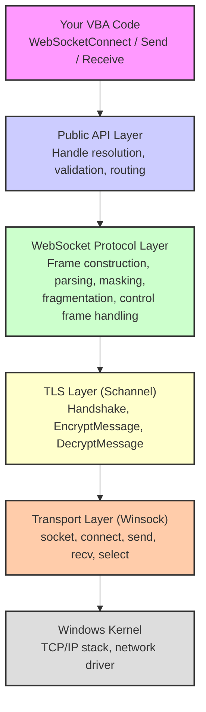

## Connection Pool

Wasabi manages all connections through a statically allocated pool of 64
`WasabiConnection` entries. Each entry holds the complete state of one
WebSocket session.

### Structure

The pool is an array of `WasabiConnection` user-defined types, initialized
on the first call to any Wasabi function via `InitConnectionPool`.

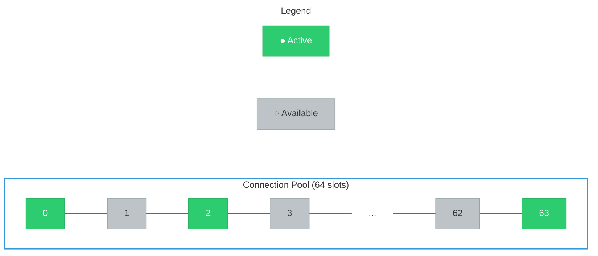

### Allocation

When `WebSocketConnect` is called, `AllocConnection` scans the pool for the
first slot where `Connected = False` and `Socket = INVALID_SOCKET`. It
initializes all fields to their defaults and returns the index as the
connection handle.

### Deallocation

When `WebSocketDisconnect` is called, `CleanupHandle` closes the socket,
releases TLS resources, and resets all fields in the slot. The slot becomes
available for reuse.

### Handle Resolution

Most public functions accept an optional handle parameter. The internal
function `ResolveHandle` translates this.

```
If handle = INVALID_CONN_HANDLE (-1)
    → use m_DefaultHandle
Else
    → use the provided handle directly
```

> [!NOTE]
> The default handle is updated automatically by `WebSocketConnect` to point
> to the most recently opened connection.

### Per-Connection State

Each `WasabiConnection` entry contains:

| Category | Fields |
|:---|:---|
| Socket | `Connected`, `TLS`, `Host`, `Port`, `Path` |
| TLS | `hCred`, `hContext`, `Sizes` |
| Receive | `RecvBuffer()`, `RecvLen`, `DecryptBuffer()`, `DecryptLen` |
| Text Queue | `MsgQueue()`, `MsgHead`, `MsgTail`, `MsgCount` |
| Binary Queue | `BinaryQueue()`, `BinaryHead`, `BinaryTail`, `BinaryCount` |
| Fragmentation | `FragmentBuffer()`, `FragmentLen`, `FragmentOpcode`, `Fragmenting` |
| Reconnect | `AutoReconnect`, `ReconnectMaxAttempts`, `ReconnectAttempts`, `ReconnectBaseDelayMs` |
| Proxy | `ProxyHost`, `ProxyPort`, `ProxyUser`, `ProxyPass`, `ProxyEnabled`, `ProxyType` |
| Heartbeat | `PingIntervalMs`, `LastPingSentAt` |
| Timeouts | `ReceiveTimeoutMs`, `InactivityTimeoutMs`, `LastActivityAt` |
| Headers | `CustomHeaders()`, `CustomHeaderCount`, `SubProtocol` |
| Statistics | `Stats` (BytesSent, BytesReceived, MessagesSent, MessagesReceived, ConnectedAt) |
| Diagnostics | `LastError`, `LastErrorCode`, `TechnicalDetails` |
| Logging | `LogCallback`, `EnableErrorDialog` |
| Configuration | `NoDelay`, `CustomBufferSize`, `CustomFragmentSize`, `OriginalUrl` |

## Connection Sequence

The full connection sequence is handled by the internal `ConnectHandle`
function. Every connection, including reconnections, passes through this
same path.

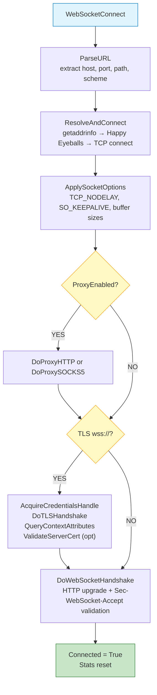

### Happy Eyeballs (RFC 6555)

The connection phase implements the Happy Eyeballs algorithm for dual-stack
hosts. When both IPv6 and IPv4 addresses are resolved:

1. IPv6 socket is created, set non-blocking, and `connect()` called immediately.
2. A 250ms race window starts. If IPv6 succeeds within this time, it wins.
3. If the race window expires, the IPv4 socket is also created.
4. Both sockets compete; the first to connect wins and the other is closed.
5. Fallback: if only one address family is available, it is used directly.

This guarantees the fastest possible connection while preferring IPv6 when
both are equally fast.

## TLS Handshake

The TLS layer is implemented through the Windows SSPI Schannel provider.
Wasabi performs the entire handshake manually rather than delegating to
WinHTTP or any higher-level abstraction.


### Credential Acquisition

Before the handshake begins, Wasabi initializes a `SCHANNEL_CRED` structure
with the following configuration:

| Field | Value | Purpose |
|:---|:---|:---|
| `dwVersion` | `SCHANNEL_CRED_VERSION` (4) | Structure version |
| `grbitEnabledProtocols` | `SP_PROT_TLS1_2_CLIENT \| SP_PROT_TLS1_3_CLIENT` | Accepted TLS versions |
| `dwFlags` | `SCH_CRED_NO_DEFAULT_CREDS` | Do not use Windows credential store |
| `dwFlags` | `SCH_CRED_MANUAL_CRED_VALIDATION` | Skip automatic certificate chain validation |
| `dwFlags` | `SCH_CRED_IGNORE_NO_REVOCATION_CHECK` | Do not fail if CRL is unavailable |
| `dwFlags` | `SCH_CRED_IGNORE_REVOCATION_OFFLINE` | Do not fail if CRL server is unreachable |

This credential is passed to `AcquireCredentialsHandle` with the package
name `"Microsoft Unified Security Protocol Provider"`.

> [!IMPORTANT]
> Certificate revocation checking is explicitly disabled (`IGNORE_NO_REVOCATION_CHECK` and `IGNORE_REVOCATION_OFFLINE`) to maximize compatibility with firewalled and offline corporate environments. This means that even if the certificate is issued by a trusted CA, the connection will proceed even if the CRL or OCSP responder is unreachable. Enabling strict revocation checking would require a registry change and is not recommended for client-side WebSocket connections in typical Office automation scenarios.

### Handshake Loop

The handshake is a multi-round exchange between the client and server.
The internal function `DoTLSHandshake` implements this as a loop.

```
Round 1: InitializeSecurityContext (first call, no input)
         → sends ClientHello
         → receives ServerHello + Certificate + ServerHelloDone

Round 2: InitializeSecurityContext (with server response)
         → sends ClientKeyExchange + ChangeCipherSpec + Finished
         → receives server ChangeCipherSpec + Finished

Result:  SEC_E_OK → handshake complete
```

Each round follows this pattern:

1. Call `InitializeSecurityContext` with the accumulated server data
2. If output token is produced, send it to the server via `sock_send`
3. If result is `SEC_I_CONTINUE_NEEDED`, read more data from the server
4. If result is `SEC_E_INCOMPLETE_MESSAGE`, read more data and retry
5. If any `SECBUFFER_EXTRA` is returned, preserve the extra bytes for the next round
6. If result is `SEC_E_OK`, the handshake is complete

The loop is protected by a maximum iteration count of 30 to prevent infinite
loops on malformed server responses.

### Post-Handshake

After the handshake completes, Wasabi queries the context for stream sizes
using `QueryContextAttributes` with `SECPKG_ATTR_STREAM_SIZES`. This returns:

| Field | Purpose |
|:---|:---|
| `cbHeader` | Size of the TLS record header (prepended to each encrypted block) |
| `cbTrailer` | Size of the TLS record trailer (appended to each encrypted block) |
| `cbMaximumMessage` | Maximum plaintext size per TLS record |

These values are used by `TLSSend` to correctly frame outgoing data.

## TLS Data Flow

### Encryption (Sending)

When `TLSSend` is called with plaintext data:

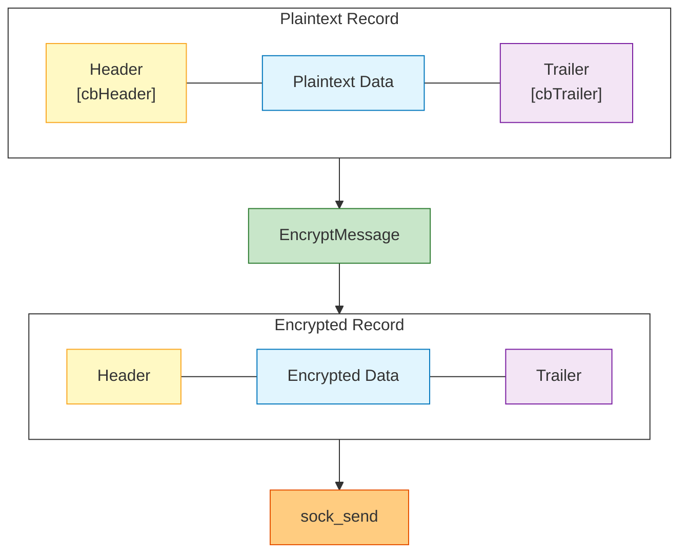

`TLSSend` automatically splits data larger than `cbMaximumMessage` into multiple TLS records, each encrypted separately and sent sequentially.

### Decryption (Receiving)

When `TLSDecrypt` processes buffered data:

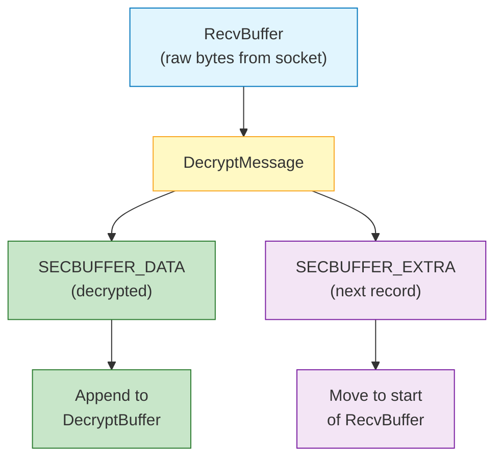

The `SECBUFFER_EXTRA` handling is critical. When the OS socket delivers
multiple TLS records in a single `recv()` call, `DecryptMessage` only
processes the first complete record and flags the remaining bytes as
`SECBUFFER_EXTRA`. Wasabi moves these bytes to the beginning of
`RecvBuffer` and loops to decrypt again.

> [!NOTE]
> If `DecryptMessage` returns `SEC_E_INCOMPLETE_MESSAGE`, the current
> `RecvBuffer` does not contain a complete TLS record. Wasabi exits the
> decrypt loop and waits for more data to arrive on the next polling cycle.

## WebSocket Handshake

After the TCP connection (and optional TLS handshake) is established, Wasabi
performs the WebSocket protocol upgrade as defined by
[RFC 6455 Section 4](https://datatracker.ietf.org/doc/html/rfc6455#section-4).


### Request

Wasabi constructs and sends an HTTP/1.1 GET request:

```http
GET /path HTTP/1.1
Host: example.com
Upgrade: websocket
Connection: Upgrade
Sec-WebSocket-Key: dGhlIHNhbXBsZSBub25jZQ==
Sec-WebSocket-Version: 13
Origin: https://example.com
User-Agent: Mozilla/5.0 (Windows NT 10.0; Win64; x64) AppleWebKit/537.36
```

The `Sec-WebSocket-Key` is a Base64-encoded 16-byte random value generated
by `GenerateWSKey`. Wasabi uses `CryptGenRandom` (from `advapi32.dll`) to
obtain cryptographically strong randomness for this key. If `CryptGenRandom`
were to fail (which should never happen on a normal system), the code falls
back to the VBA `Rnd` function.

If custom headers, subprotocol, or proxy credentials are configured, they
are appended before the final blank line.

### Response Validation

Wasabi validates the server response in two steps:

**1. Status code check**

The response must contain HTTP status `101` (Switching Protocols). Any
other status triggers `ERR_HANDSHAKE_REJECTED`.

**2. Accept key validation**

Wasabi computes the expected accept value:

```
expected = Base64(SHA1(key + "258EAFA5-E914-47DA-95CA-C5AB0DC85B11"))
```

This is compared against the `Sec-WebSocket-Accept` header in the server
response. A mismatch triggers `ERR_HANDSHAKE_REJECTED`.

The SHA-1 implementation is internal to Wasabi and does not depend on any
external library. See the [SHA-1 section](#sha-1-implementation) below.

## Frame Processing

WebSocket communication happens through frames as defined by
[RFC 6455 Section 5](https://datatracker.ietf.org/doc/html/rfc6455#section-5).

### Frame Format

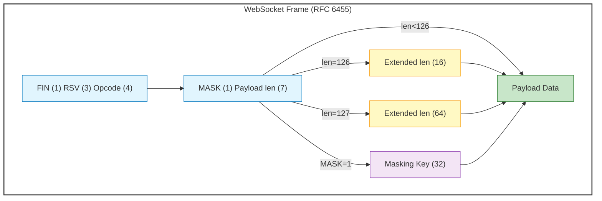

### Outgoing Frames (Sending)

When `WebSocketSend` or `WebSocketSendBinary` is called:

1. The payload is measured in bytes (UTF-8 for text, raw for binary)
2. A 4-byte cryptographically random mask key is generated via `CryptGenRandom` (`FillRandomBytes`)
3. The frame header is constructed with the FIN bit set, the appropriate
   opcode (`0x01` for text, `0x02` for binary), and the MASK bit set
4. The payload length is encoded in the appropriate tier
5. Each payload byte is XORed with `mask(i Mod 4)`
6. The complete frame is sent via `RawSendFor` (or `TLSSend` for TLS)

### Incoming Frames (Receiving)

The internal function `ProcessFrames` parses frames from the
`DecryptBuffer`:

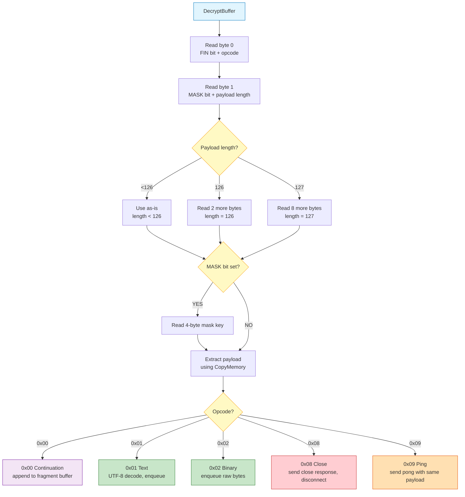

### Fragmentation

Large messages may arrive split across multiple frames. The first frame
has a non-zero opcode and the FIN bit cleared. Continuation frames use
opcode `0x00`. The final frame has the FIN bit set.

```
Frame 1: FIN=0, opcode=0x01 (Text), payload="Hello "
Frame 2: FIN=0, opcode=0x00 (Continuation), payload="from "
Frame 3: FIN=1, opcode=0x00 (Continuation), payload="Wasabi"

Result: "Hello from Wasabi"
```

Wasabi accumulates fragments in the per-connection `FragmentBuffer` using
`CopyMemory`. When the final FIN frame arrives, the complete payload is
assembled and enqueued as a single message.

> [!NOTE]
> The fragment buffer size defaults to 256KB and can be configured via
> `WebSocketSetBufferSizes` before connecting.

## Message Queues

Each connection maintains two independent circular queues (ring buffers):
one for text messages and one for binary messages.


### Structure

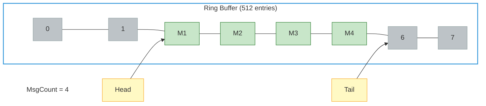

### Operations

**Enqueue (new message arrives):**
```
MsgQueue(MsgTail) = message
MsgTail = (MsgTail + 1) Mod MSG_QUEUE_SIZE
MsgCount = MsgCount + 1
```

**Dequeue (WebSocketReceive called):**
```
result = MsgQueue(MsgHead)
MsgHead = (MsgHead + 1) Mod MSG_QUEUE_SIZE
MsgCount = MsgCount - 1
```

Both operations are O(1) with no memory allocation or copying beyond the
initial array setup.

> [!WARNING]
> When `MsgCount` reaches `MSG_QUEUE_SIZE` (512), new messages are
> discarded and a warning is logged.

## Receive Pipeline

The complete data flow from network to your code.

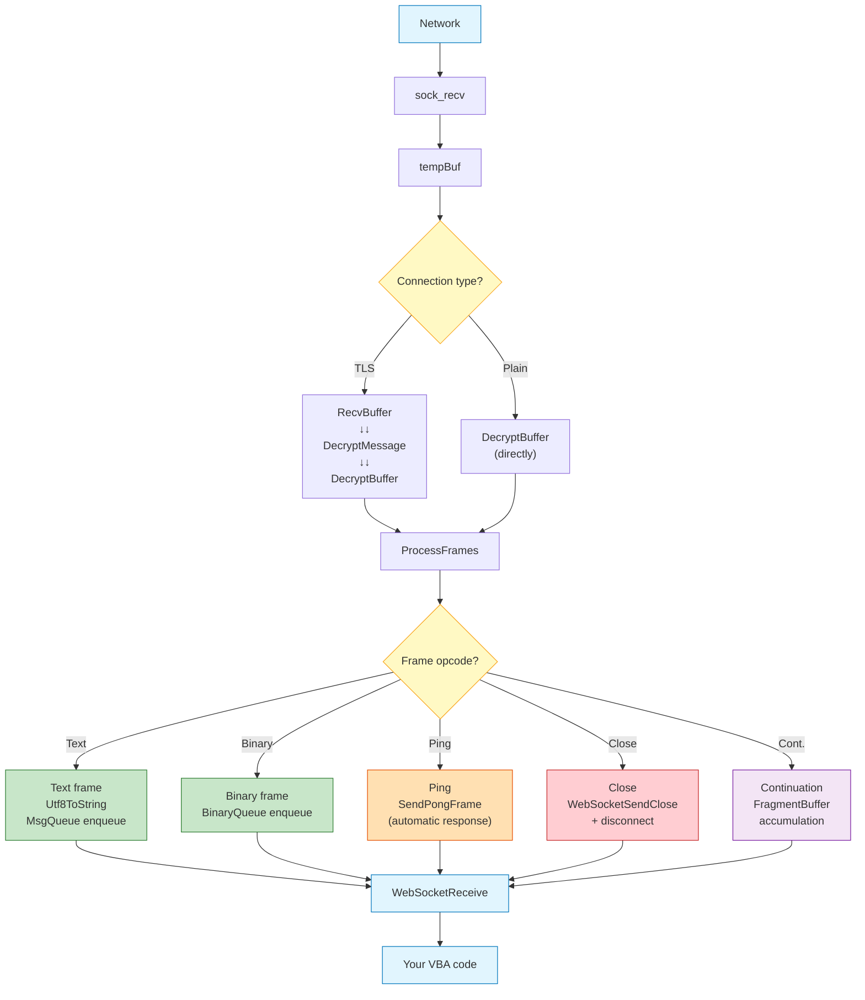

### Buffer Sizes

| Buffer | Default Size | Configurable |
|:---|:---|:---|
| `RecvBuffer` | 256KB | Yes, via `WebSocketSetBufferSizes` |
| `DecryptBuffer` | 256KB | Yes, via `WebSocketSetBufferSizes` |
| `FragmentBuffer` | 256KB | Yes, via `WebSocketSetBufferSizes` |
| Text queue | 512 entries | No (compile-time constant) |
| Binary queue | 512 entries | No (compile-time constant) |

## Auto-Reconnect

When a connection loss is detected during polling and auto-reconnect is
enabled, Wasabi executes the following sequence.

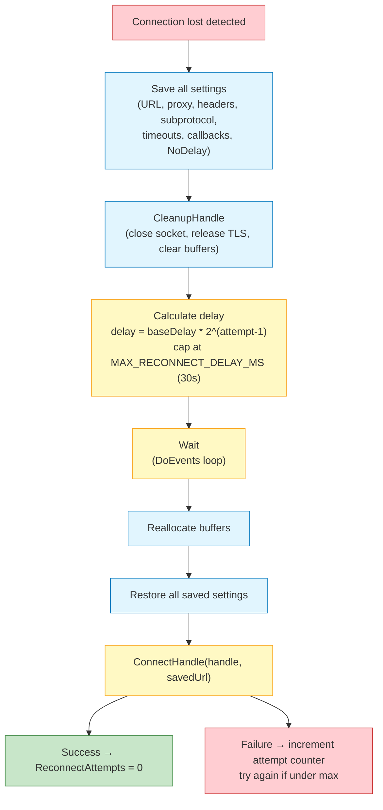

### Backoff Pattern

| Attempt | Delay (base = 1000ms) |
|:---|:---|
| 1 | 1000ms |
| 2 | 2000ms |
| 3 | 4000ms |
| 4 | 8000ms |
| 5 | 16000ms |
| 6+ | 30000ms (capped) |

> [!IMPORTANT]
> The reconnect delay loop uses `DoEvents`, which yields to the Windows
> message pump but does not fully release the VBA thread. The Office UI
> remains partially responsive during this wait.

## SHA-1 Implementation

Wasabi includes a complete SHA-1 implementation in pure VBA for computing
the `Sec-WebSocket-Accept` header during the WebSocket handshake, as
required by [RFC 6455 Section 4.2.2](https://datatracker.ietf.org/doc/html/rfc6455#section-4.2.2).

### Why Internal

The SHA-1 hash is needed exactly once per connection. Using an external
dependency (such as `ScriptControl` or a COM hash object) would break
Wasabi's zero-dependency constraint. The internal implementation ensures
the module remains a single portable `.bas` file.

### Unsigned 32-bit Arithmetic

VBA's `Long` type is a signed 32-bit integer. SHA-1 requires unsigned
32-bit addition and rotation. Wasabi works around this with three helper
functions:

| Function | Purpose |
|:---|:---|
| `ADD32(a, b)` | Unsigned 32-bit addition using split high/low halves |
| `ROTL32(v, n)` | Left rotation by n bits using iterative shift and carry |
| `U32Shl1(v)` | Single-bit left shift handling the sign bit explicitly |

These functions use bitmasks (`&H7FFF`, `&HFFFF`, `&H80000000`) to
isolate and manipulate individual bit ranges without triggering VBA
overflow errors.

### SHA-1 Constants

| Round Range | Constant | Hex |
|:---|:---|:---|
| 0 to 19 | `0x5A827999` | `&H5A827999` |
| 20 to 39 | `0x6ED9EBA1` | `&H6ED9EBA1` |
| 40 to 59 | `0x8F1BBCDC` | `&H8F1BBCDC` |
| 60 to 79 | `0xCA62C1D6` | `&HCA62C1D6` |

### Initial Hash Values

```
h0 = 0x67452301
h1 = 0xEFCDAB89
h2 = 0x98BADCFE
h3 = 0x10325476
h4 = 0xC3D2E1F0
```

## Proxy Tunnel

When proxy is enabled, Wasabi establishes an HTTP CONNECT tunnel (or a
SOCKS5 tunnel) before performing TLS or WebSocket handshaking.

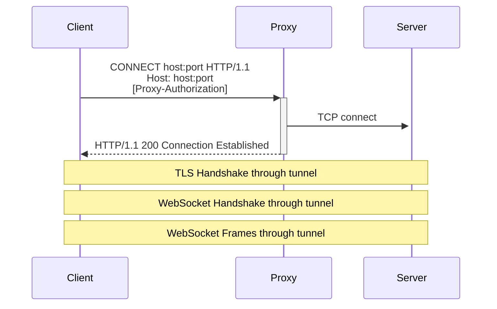

> [!NOTE]
> The proxy only sees the CONNECT request. After the tunnel is established,
> all subsequent traffic (TLS, WebSocket) passes through opaquely. The proxy
> cannot inspect the encrypted content.

## Maintenance Cycle

Every call to `WebSocketReceive` triggers an internal maintenance pass
via `TickMaintenance`. This is the only mechanism for time-based
features because VBA does not support background timers.

### What Maintenance Checks

| Check | Condition | Action |
|:---|:---|:---|
| Automatic Ping | `PingIntervalMs > 0` and interval elapsed | Send Ping frame |
| Inactivity Timeout | `InactivityTimeoutMs > 0` and threshold exceeded | Close connection, trigger reconnect if enabled |
| MTU Probe | `AutoMTU` and `ProbeEnabled` and interval elapsed | Call `ProbeMTU` to re-measure MSS |

> [!IMPORTANT]
> If your code stops calling `WebSocketReceive`, maintenance also stops.
> Automatic pings will not be sent and inactivity timeouts will not fire.

## Memory Layout

Wasabi uses pre-allocated byte arrays instead of dynamic string
concatenation to minimize heap fragmentation in long-running sessions.

```
Per connection memory footprint (default settings):

  RecvBuffer:      256 KB
  DecryptBuffer:   256 KB
  FragmentBuffer:  256 KB
  MsgQueue:        512 × String pointer
  BinaryQueue:     512 × Byte array pointer
  CustomHeaders:   32 × String pointer

  Total baseline: ~768 KB + queue overhead per connection
  Maximum (64 connections): ~48 MB
```

> [!NOTE]
> The actual memory consumed depends on the size of queued messages and
> the configured buffer sizes. The baseline above represents the fixed
> allocation before any messages are received.

## Error Propagation

Errors in Wasabi propagate through two parallel paths.

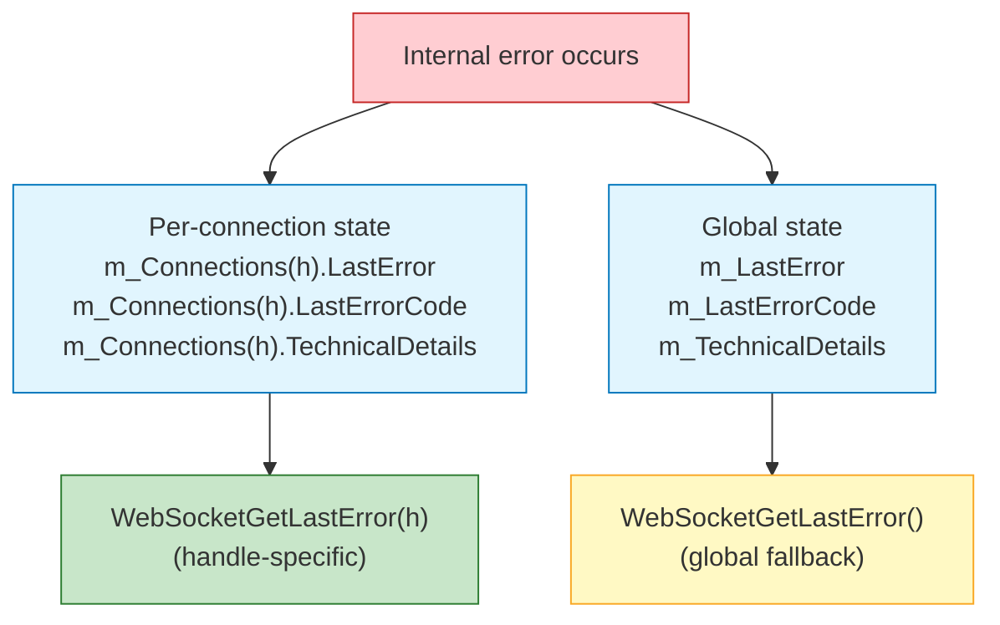

When a function is called with a valid handle, the per-connection error
state is returned. When called without a handle or with an invalid handle,
the global error state is returned.

> [!TIP]
> Always pass the handle when checking errors to get the most specific
> information.

## Related Documentation

- [API Reference](API_REFERENCE.md) for the complete public API
- [Error Reference](ERRORS.md) for detailed error diagnostics
- [SECURITY.md](../SECURITY.md) for security design decisions
- [RFC 6455](https://datatracker.ietf.org/doc/html/rfc6455) for the WebSocket protocol specification
- [SSPI/Schannel documentation](https://learn.microsoft.com/en-us/windows/win32/secauthn/sspi) for the TLS implementation reference
- [Winsock documentation](https://learn.microsoft.com/en-us/windows/win32/winsock/winsock-functions) for the transport layer reference
